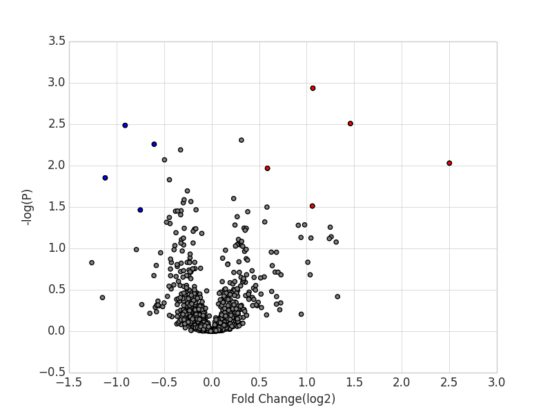
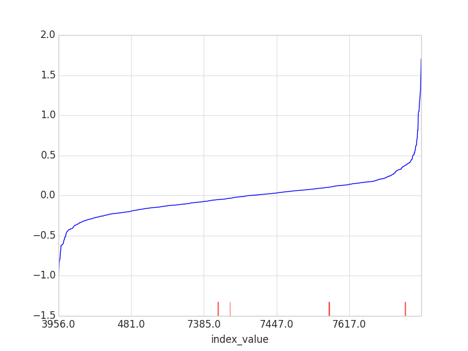
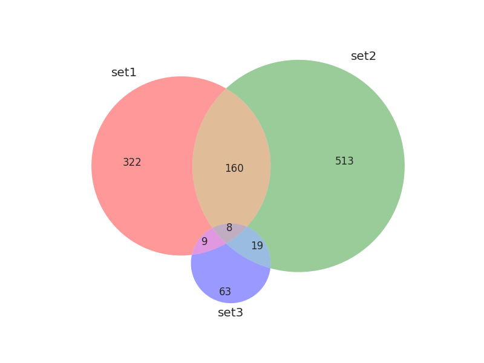

<h3>Simple Plots for Python (3 Venn diagram, Volcano plot, Rank sorted line-plot</h3>

This library includes 3 simple plots function and easy-to-use, and data should be formed by Pandas. For the detail, please see the main.py code.

If you find any bugs or troubles, let me know(Contact : swiri021@gmail.com)

Required library : Pandas, Numpy, matplotlib, seaborn, matplotlib_venn

Please install these required libraries by using pip install

 
 
<h4>Installation: </h4>

No installation required for this library, just download and use it.

 
 
<h4>Usage example: </h4>
 
<h5>Volcano plot</h5>

pt.volcano_plot(df, x_ax='Fold Change', y_ax='FDR', output_name='volcano') # Volcano plot

 
<h5>Rank sorted line-plot</h5>

pt.rankplot(df,df_c) # No marker

pt.rankplot(df,df_c, selected_on=True, selected_data=selected_data) # With marker

 
<h5>3 Venn diagram</h5>

pt.venn_dia(n_df, scaling='bypass') # No scaling

pt.venn_dia(n_df, scaling='log2') # Log2 scaling

 
 
<h4>Output example: </h4>

Volcano plot

Rank sorted line-plot

3Venn diagram

